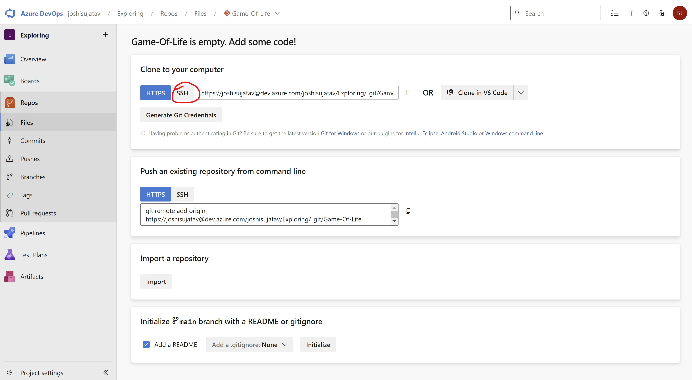

## Agile way of Software Development
* Agile had added smaller and frequent releases, this needs more aggressive automations than CI.

**Expectation:**
  - Automated Pipeline which when developer pushes changes
  - Build/Package code
  - Code Quality and Security Issues
  - Automate test executions with System, Performance, Reliablity, Security
  - Report of the Quality of work done yesterday
  - Customer and Internal Releases every 2 weeks

<u>------------------------------------------------------------------------------------------</u>
### Quick Overview of Continuous Delivery Pipeline
* Overview


### Building and Packaging the code
* Building the code and packaging the code to the suitable format for end deployment is very technology specific i.e. it is different depending on programming languages.
* Programming Languages can be categorized into 3 formats

    **Compiler based:**

    

    **Interpreter based:**

    **Hybrid:**

    
    
<u>------------------------------------------------------------------------------------------</u>
### Dependecny Managment
* To develop any application , there will be lots of dependencies on other libraries/sdks
* before building/packaging we need to download these dependencies
    * nodejs npm
    * python pip
    * .net nuget
    * java mvn

### Test Executions :
* unit tests (test code by writing code) => developers
* integration tests
    * unit test
    * ui test
    * api test
* Functional tests
    * ui tests (simulate user) => selenium, cypress, qtp…
    * api tests (postman, rest assured)
* Performance tests:
    * load testing harness (jmeter, load runner)
* What we should know for ci/cd
    * command to invoke tests
    * where will be test results
    * converting test results to some common formats (junit xml)

### Java Based Applications:
* To build <u>**Java**</u> Based applications, we have many tools
    - ANT
    - Maven
    - Gradle
* <u>Build steps:</u>
    - mvn package
    - mvn clean install 

### Building and Packaging **Dotnet**
* <u>.net framework versions:</u>
    - .net 2,3,4 (Windows)
    - .net 5 +
        - .net core
        - aspnet core
* <u>Build steps:</u> (require either project or solution  files(.sln/.proj))
    - dotnet restore <sln/proj>
    - dotnet build <sln/prog>
    - dotnet publish <sln/prog>

<u>=====================================================</u>

## Azure DevOps
* Azure DevOps offers services to manage whole project
    * Project Management
        - Planning:
            * Agile Boards
            * Issue Tracker
        - Execution:
            * Wiki Pages
            * Test Management
    * DevOps:
        * VCS: 
            * Azure Source Repos
                - Git
                - TFVC
        *  Pipelines:
            - Build Pipelines
            - Release Pipelines
        *  Artifacts

### Azure DevOps can be used by two ways
* Self-Hosted [Refer here](https://learn.microsoft.com/en-us/azure/devops/server/download/azuredevopsserver?view=azure-devops)
* Cloud-Hosted [Refer here](https://azure.microsoft.com/en-in/products/devops)

### Azure DevOps Services: Cloud Hosted Version of Azure DevOps
   * Pricing: [Refer here](https://azure.microsoft.com/en-in/pricing/details/devops/azure-devops-services/)
   

### <u>Initial setup:-</u>
* Create a git account


### Importing an Existing git repo into Azure DevOps
* Import Repository from github into your account


### Azure DevOps Pipeline
* Azure DevOps Pipelines are expressed in yaml formats in git repositories generally with name azure-pipelines.yaml


* YAML Schema for azure devops pipelines   - [Refer Here](https://learn.microsoft.com/en-us/azure/devops/pipelines/yaml-schema/?view=azure-pipelines)
 * [Refer here](https://learn.microsoft.com/en-us/azure/devops/pipelines/yaml-schema/pipeline?view=azure-pipelines)

* Key Concepts of Azure DevOps [Refer here](https://learn.microsoft.com/en-us/azure/devops/pipelines/get-started/key-pipelines-concepts?view=azure-devops)


### Pipeline:
    - Where should it execute? => Agents
    - When should it run => Trigger
    - What should happend when pipeline executes
        * Stages
        * Jobs
        * Steps
* When pipeline is executed it is execute with code from version control already cloned and in the branch specified
```
---
trigger:
  - master

pool: ubuntu-latest

stages:
  - stage: stage1
    displayName: first stage

    jobs: 
      - job: build code
        displayName: Build Code
        steps:
          - task: Maven@4
            inputs:
              mavenPOMFile: 'pom.xml'
              goal: package
```
* If your pipeline has only one stage, consider pipeline is collection of jobs
* Lets try to write the same pipeline above as collection of jobs as we have only one stage
```
---
name: learning
trigger:
  - master
pool: ubuntu-latest
jobs:
  - job: buildjob
    displayName: Build JOB
    steps:
      - task: Maven@4
        inputs:
          mavenPOMFile: 'pom.xml'
          goal: 'package'
```
* Lets write the pipeline as collection of steps
```
---
name: learning
trigger:
  - master
pool: ubuntu-latest
steps:
  - task: Maven@4
    inputs:
      mavenPOMFile: 'pom.xml
```

### Agents in Azure DevOps Pipeline

* Azure DevOps Pipelines have two types of Agents:
  - **Microsoft hosted Agent** [Refer here](https://learn.microsoft.com/en-us/azure/devops/pipelines/agents/hosted?view=azure-devops&tabs=yaml)


  - Size is always fixed Standard_D2S i.e. 2 vcpu's 8 GB RAM

  - <u>**When to use:** </u>
      -  Build/Deploy uses standard tools/softwares and if the configuration required matches the above statement
      - No/Little configuration is what you like in CI/CD pipelines for executions

  - **Self Hosted Agents**[Refer here](https://learn.microsoft.com/en-us/azure/devops/pipelines/agents/linux-agent?view=azure-devops)
  
    - You need to configure agent to connect to azure devops(machine can be in any cloud azure,aws,gcp etc.)

* Azure DevOps Pipleines can be summarized as shown below

  - Till artifacts,it wiil be build pipeline.
  - After artifacts,release pipeline for deployment

  
### <u>**Configuring Self Hosted Agent**</u>
* Setting up agent to build jdk 17 and maven based softwares
  - Create a linux vm(Size = Standard_B2s)

  - install jdk 17 and maven
    ```
    sudo apt update 
    sudo apt install openjdk-17-jdk maven -y
    ```
### Now navigate to project settings and agent pools


* Create Personal Access Token


* Now come back to Add Agent

click on copy and go to the VM
```
wget <paste-it-here>
```

Now follow the stepes that are given 

```
mkdir myagent && cd myagent
tar zxvf ~/vsts-agent-linux-x64-3.220.5.tar.gz
./config.sh
./run.sh
```


* Import a repository in Azure-Devops using CLI based
  * Steps:
     - Create a folder in local machine

     - Clone the code

     - Now, in azure-devops
  




Now copy id_rsa.pub key from local machine

Copy SSH url


* Now lets try to create a simple azure devops build pipeline
```
# Starter pipeline
# Start with a minimal pipeline that you can customize to build and deploy your code.
# Add steps that build, run tests, deploy, and more:
# https://aka.ms/yaml

trigger:
- main

pool:
  name: Default
steps:
  - bash: printenv
```


<u>------------------------------------------------------------------------------------------</u>
#### Building Project in Azure DevOps using Self Hosted Agent

* Azure Pipeline yaml schema [Refer here](https://learn.microsoft.com/en-us/azure/devops/pipelines/yaml-schema/?view=azure-pipelines)

* **<u>Task</u>** in Azure DevOps Pipelines: Tasks internally get converted in low level os commands/api calls.
* Azure DevOps has lot of predefined tasks [Refer here](https://learn.microsoft.com/en-us/azure/devops/pipelines/tasks/reference/?view=azure-pipelines)


* We can also get additional tasks from Market as a Extensions [Refer Here](https://marketplace.visualstudio.com/azuredevops)


* Lets achieve building the code without using any task.

* <u>**Java Project**</u>
  -  Manual command is 'mvn package'
    - install Java 8
    - install Maven (Game of life)
```
trigger:
- master

pool:
  name: Default

steps:
  - bash: mvn package
```
* Push the above changes to azure repo and then and build will start (trigger)


```
trigger:
- master

pool:
  name: Default

steps:
  - bash: mvn package
    displayName: "Build package using Maven"
```


### Lets try using tasks for maven [Refer here](https://learn.microsoft.com/en-us/azure/devops/pipelines/tasks/reference/maven-v4?view=azure-pipelines)

```
trigger:
- master

pool:
  name: Default

steps:
  - task: Maven@3
    inputs:
      mavenPomFile: 'pom.xml'
      goals: 'package'
      publishJUnitResults: true
      testResultsFiles: '**/surefire-reports/TEST-*.xml'
      testRunTitle: 'RunUnitTests'
```


<u>-----------------------------------------------------------------------------------------------</u>
* <u>**Dotnet Project**</u>
* Manual steps:
    - Install .net 7
```
git clone https://github.com/nopSolutions/nopCommerce.git
cd nopCommerce
git checkout master
dotnet restore src/NopCommerce.sln
dotnet build src/NopCommerce.sln
```
* Find tasks to perform restore and build and fill with the values required to build this project google **'azure devops task list'**
